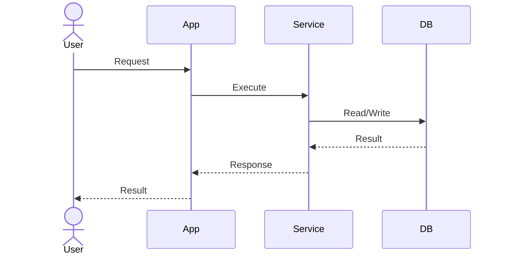

# 実行・処理フロー

## 1. 主要フロー

```mermaid
sequenceDiagram
    actor User
    participant App
    participant Service
    participant DB
    User->>App: Request
    App->>Service: Execute
    Service->>DB: Read/Write
    DB-->>Service: Result
    Service-->>App: Response
    App-->>User: Result
```

## 2. 正常系

## 3. 異常系

## 4. トランザクション境界

## 5. 非同期処理

## 6. 冪等性

## 7. Evidence
