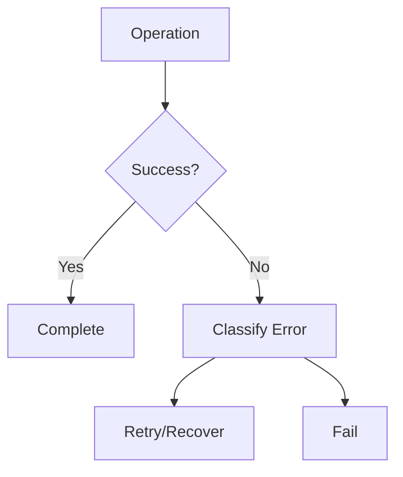

# エラー・リカバリ

| Error | Cause | Detection | Response | Retry | Rollback/Compensation | Evidence |
|---|---|---|---|---|---|---|

## Error flow

```mermaid
flowchart TD
    A[Operation] --> B{Success?}
    B -->|Yes| C[Complete]
    B -->|No| D[Classify Error]
    D --> E[Retry/Recover]
    D --> F[Fail]
```

## Observability

## Recovery assumptions

## Unknowns
